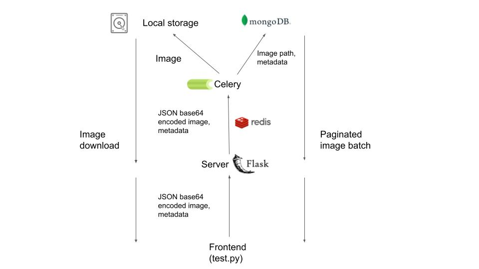

# Caper Assessment

This repo consists of an image storage system implemented as a containerized Flask app with Celery for batch processing and Mongo database. Images are stored in the server's disk space, and the database stores the image's path and image metadata such as timestamp, store name, camera ID, and barcode. Basic endpoints are implemented to upload a batch of images, retrieve batches of images (image metadata and URLs) in a paginated fashion, and download an image given its path. Upon upload, async saving of the images and their metadata is performed as a Celery task whilst endpoint response is immediate.

Please refer to the following diagram:


## Key Files

* `docker-compose.yaml` defines services to launch (Flask, MongoDB, a Celery worker, and Redis)
* `flask/app.py` defines Flask app, database models via MongoEngine, endpoints, basic config, etc.
* `test.py` uploads 3 images to server

## Endpoints

* **POST** `/upload_image_batch`
  
  JSON body:
    ```
    [ 
      {
        "file"      : "<base 64 encoded image>"
        "timestamp" : "<timestamp>",
        "store_name': "<store name>",
        "camera_id' : "<camera ID>",
        "barcode'   : "<barcode>"

      },
      ...
    ]
    ```
    See `tests.py` for example.
    
* **GET** `/image_batches?page=<page>&per_page=<per_page>`
* **GET** `/uploads/<uuid>.jpg`

## Database

The database has a simple batch structure:
```
[
  [
    [ 
      {
        "file_path" : "<relative image URL>"
        "timestamp" : "<timestamp>",
        "store_name': "<store name>",
        "camera_id' : "<camera ID>",
        "barcode'   : "<barcode>"
      },
      ...
    ],
  ...
  ]
]
```

## Testing
* `docker-compose up`
* `python3 test.py`
* `curl http://localhost:5000/image_batches\?page\=1\&per_page\=100`
* `curl http://localhost:5000/uploads/<uuid>.jpg`

## Future

A practical production implementation would probably store images in separate cloud storage such as Amazon S3. Other backend framework alternatives to Flask might include FastAPI or Django REST.

To deploy this as is, at least a production web server should be stood up bridging to Flask with uWSGI or Gunicorn middleware in addition to version freezing, better error handling, and logging. Additional endpoints could be added for retrieval/querying by metadata.
